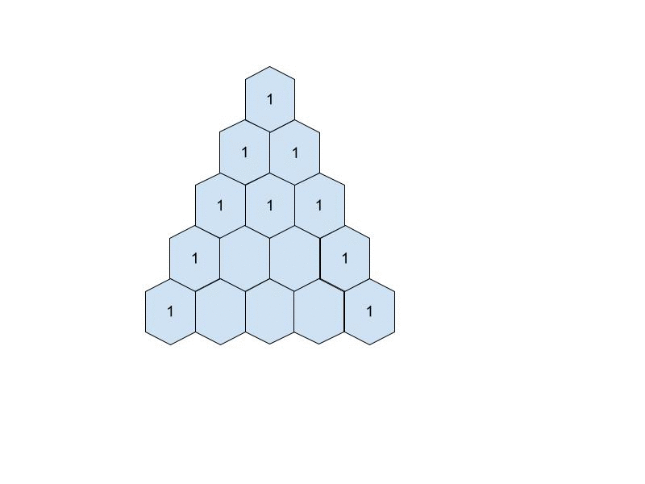

Program to generate Pascal's Triangle

177

6
Problem Statement: This problem has 3 variations. They are stated below:

Variation 1: Given row number r and column number c. Print the element at position (r, c) in Pascal’s triangle.

Variation 2: Given the row number n. Print the n-th row of Pascal’s triangle.

Variation 3: Given the number of rows n. Print the first n rows of Pascal’s triangle.

In Pascal’s triangle, each number is the sum of the two numbers directly above it as shown in the figure below:

